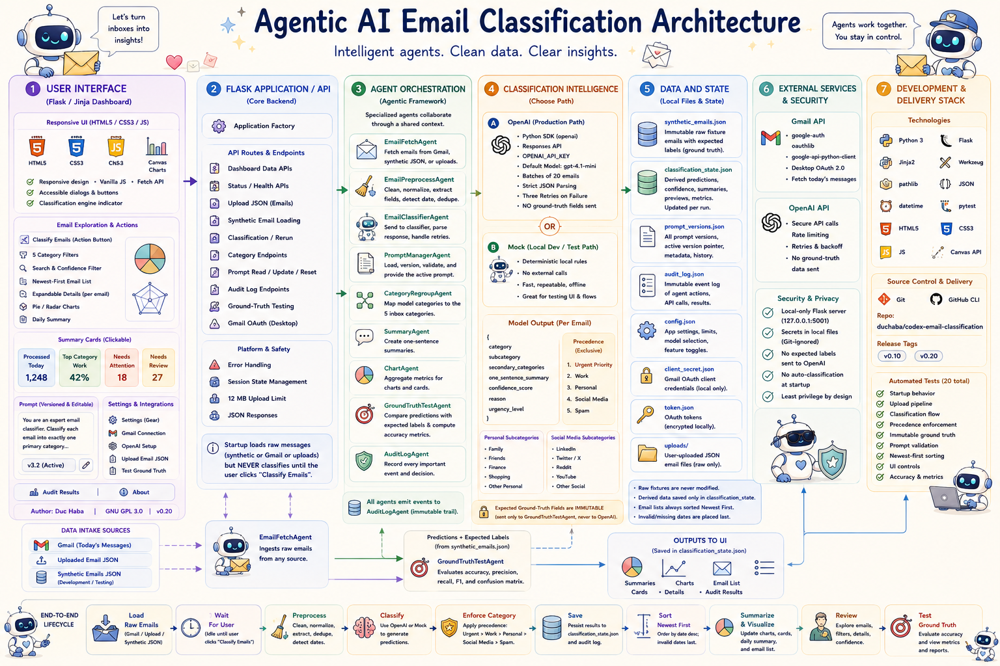

# Duc Haba Atelier
## Agentic AI Email Classifier

This AI-powered email dashboard turns inbox chaos into clarity by sorting messages into Urgent, Work, Personal, Social Media, and Spam. It can summarize your day, highlight what matters, test its own accuracy, and even draft replies—because your attention belongs on important decisions, not inbox archaeology.

### Key features

Here are three key features that other email classification tools, such as Gmail and Outlook, lack.

- **Measure Accuracy** — Accuracy based on your data.
  - Most email‑classification tools claim “high accuracy,” but how do they measure accuracy without data? Without you creating the ground truth, i.e., the actual email you classify, how can they measure accuracy?
- **Customize LLM Logic** — Tailored Intelligence Instead of One‑Size‑Fits‑All.
  -  Editable classification logic lets you define rules, heuristics, or domain‑specific instructions that guide the LLM.
- **Privacy & Security** — Local app and not cloud-based.
  - Email is the most sensitive data surface in any organization. It should never be shared on the other cloud. 

### AI Solution Architect course by ELVTR and Duc Haba

- I look forward to seeing you in class: [AI Solution Architect](https://elvtr.com/course/ai-solution-architect)

## Screenshot


---
‣ 

## Run locally

```bash
python3 -m venv .venv
source .venv/bin/activate
pip install -r requirements.txt
python run.py
```

Open `http://127.0.0.1:5000`.

At startup, the app loads the synthetic fixture but does not automatically classify it. Click **Classify emails** on the dashboard when you are ready to run the mock rules or configured AI model.

The **Test Ground Truth** tool compares the already saved synthetic predictions with `expected_category` and `expected_subcategory`. It never runs classification again and never changes the expected labels.

---
‣ 

## Data modes

- **Synthetic demo:** the tracked `data/synthetic_emails.json` fixture contains 50 AI-generated full-body emails. Raw prediction fields are blank; `expected_category` and `expected_subcategory` provide evaluation ground truth and are not sent to or read by the classifier. The app generates the original fallback fixture automatically only when the file is missing.
- When a raw email has a blank `body_preview`, clicking **Classify emails** derives the preview from `full_body_optional` before running mock or AI classification. The derived preview and predicted labels are saved in local classification state, not written back into the tracked raw fixture.
- **Uploaded email JSON:** accepts a non-empty JSON array with `sender_email` and `subject` on every email object. Other supported fields include `email_id`, `date`, `sender_name`, `body_preview`, and `full_body_optional`. Uploading loads the raw messages; click **Classify emails** to run mock or AI classification.
- **Live Gmail:** fetches only messages whose timestamps fall on the current local calendar day.

---
‣ 

## Optional OpenAI setup

Enter an API key in the dashboard setup dialog, or copy `.env.example` to `.env` and set `OPENAI_API_KEY`. Without a key, the app uses deterministic local rules. Local secrets and tokens are excluded by `.gitignore`.

## Optional Gmail setup

1. Create a Google Cloud OAuth client with application type **Desktop app** and enable the Gmail API.
2. Download the credentials as `data/client_secret.json`.
3. Install dependencies and click **Connect Gmail** in Setup.
4. Add `http://127.0.0.1:5000/oauth2/callback` as an authorized redirect URI if your OAuth client requires it.

The app requests Gmail read and send access and stores the OAuth token locally in `data/token.json`. Sending always requires an explicit confirmation in the reply composer. Existing read-only tokens must reconnect once to grant send permission.

---
‣ 

## Tests

```bash
pytest -q
```

---
‣ 

## Step-by-Step procedure to create the Google OAuth client secret JSON file

For this app, you need a Google OAuth client secret JSON file, saved here:
/Users/~your-location/Documents/~your-project/data/client_secret.json
Step by step:

1. Go to Google Cloud Console: https://console.cloud.google.com/

1. Create or select a project.

1. Enable the Gmail API:
Go to APIs & Services → Library → search Gmail API → click Enable.

1. Configure the OAuth consent screen:
Go to Google Auth Platform → Branding.
Add an app name, your email, and the contact email.

1. Add yourself as a test user:
Go to Google Auth Platform → Audience.
If the app is in testing mode, add your Gmail address as a test user.

1. Create the OAuth client:
Go to Google Auth Platform → Clients → Create Client.

1. Choose app type:
Select Desktop app.

1. Name it something simple:
Example: Email Classification Dashboard Local.

1. Click Create.

1. Download the JSON file.

1. Rename the downloaded file to:
client_secret.json

1. Put it here:
   /Users/~your-location/Documents/~your-project/data/client_secret.json

1. It should look similar to the sample file already in your project:
/Users/~your-location/Documents/~your-project/data/client_secret_sample.json

1. After that, when the app asks you to connect Gmail, Google will open a login page and create a local token file at:
/Users/~your-location/Documents/~your-project/data/token.json

1. Source: [Google Gmail API Python Quickstart](https://developers.google.com/workspace/gmail/api/quickstart/python)

---
‣

# Estimate Daily Cost for Using "Duc Haba Atelier"

- Classifying **50 emails** costs approximately **1 cent**, or about $0.00018 per email.

For the 50 synthetic emails:
```
Usage	                 tokens	      Cost
Classification input	 7,900	      $0.0032
Classification output	 3,700	      $0.0060
Total	                 11,600	      $0.0092
---------------------
Typical daily total      *25,000      $0.0198 (about 2 cents)
```

The app also generates a daily AI brief after classification. Including that, expect roughly $0.01–$0.012 per run.
GPT-4.1 mini pricing: $0.40/1M input tokens and $1.60/1M output tokens. Actual usage varies with email length and response size.

- Why choose the GPT-4.1-mini model instead of the latest 5.x model?

The reason is that the GPT-4.1-mini is sufficient for tasks like email classification and drafting response emails, while being very cost-effective. In contrast, newer models, such as GPT-5.5, are considered over-engineered for these tasks and are over 2,000 times more expensive.

---
‣ 

# Architecture Diagram



---
‣ 

## Behind the Scenes 

- See the [PROJECT_HANDOFF.md](PROJECT_HANDOFF.md) file for more details on how this app was built.

---
‣

# Legal

- GNU Affero General Public License v3.0
